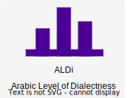

[](https://huggingface.co/spaces/AMR-KELEG/ALDi)
[](https://github.com/AMR-KELEG/ALDi/raw/master/data/AOC-ALDi.tar.gz)
[](https://arxiv.org/abs/coming-soon)

The codebase for the **ALDi: Quantifying the Arabic Level of Dialectness of Text** paper accepted to [EMNLP 2023](https://2023.emnlp.org/).

## Fine-tuned models on 🤗

Model | Link on 🤗
---|---
**Sentence-ALDi** (random seed: 42) | https://huggingface.co/AMR-KELEG/Sentence-ALDi
Sentence-ALDi (random seed: 30) | https://huggingface.co/AMR-KELEG/Sentence-ALDi-30
Sentence-ALDi (random seed: 50) | https://huggingface.co/AMR-KELEG/Sentence-ALDi-50
**Token-DI** (random seed: 42) | https://huggingface.co/AMR-KELEG/ALDi-Token-DI
Token-DI (random seed: 30) | https://huggingface.co/AMR-KELEG/ALDi-Token-DI-30
Token-DI (random seed: 50) | https://huggingface.co/AMR-KELEG/ALDi-Token-DI-50

## Dependencies
* Create a conda env:
```
conda create -n ALDi python=3.9.16
```

* Activate the environment, and install the dependencies:
```
conda activate ALDi
pip install -r requirements.txt
```

* For using the Dialect Identification model of `camel_tools`:
```
camel_data -i defaults
```

## Data

The following scripts download the datasets from their respective sources, then apply the preprocessing steps described in the paper, generating `.tsv` data files to the `data/` directory.
* Create the splits for the AOC-ALDi dataset:
```
python prepare_AOC.py
```

* Form parallel corpora files:
```
python prepare_DIAL2MSA.py
python prepare_bible.py
```

* For generating the MSA lexicon used for the baseline model, download the [UN proceedings](https://conferences.unite.un.org/UNCorpus/Home/DownloadOverview) into `data/MSA_raw_corpora/`

    * Create the directory:
    ```mkdir -p data/MSA_raw_corpora/```
    * Download the tar file parts into the directory following these urls:
        * https://conferences.unite.un.org/UNCorpus/Home/DownloadFile?filename=UNv1.0.ar-en.tar.gz.00
        * https://conferences.unite.un.org/UNCorpus/Home/DownloadFile?filename=UNv1.0.ar-en.tar.gz.01
    * Extract the downloaded tar file:
    ```cd data/MSA_raw_corpora/ && cat UNv1.0.ar-en.tar.gz.0* | tar -xzv && mv ar-en/ UN-en-ar/```

* To fine-tune the token DI model, download the "Modern Standard Arabic - Egyptian Arabic (MSA - EA)" data file from [LinCE](https://ritual.uh.edu/lince/datasets) into `data/LinCE`
    * Create the directory:
    ```mkdir -p data/LinCE/```
    * Download the data zip file (named `lid_msaea.zip`) into the directory.
    * Decompress the file into the directory: `unzip lid_msaea.zip`
        * Expected structure:
        ```
        data/LinCE
        └── lid_msaea
            ├── dev.conll
            ├── test.conll
            └── train.conll
        ```

## Models

### Sentence-ALDi model
* Fine-tuning the Sentence-ALDi model
```
# Set the ID of the GPU device
CUDA_ID="0"

# Fine-tune the model
SEED="42"
MODEL_NAME="UBC-NLP/MARBERT"
CUDA_VISIBLE_DEVICES="$CUDA_ID" python finetune_BERT_models.py train --train data/AOC/train.tsv --dev data/AOC/dev.tsv -model_name "$MODEL_NAME" -o Sentence_ALDi -s "$SEED"
```

### Baseline models
* Building the MSA lexicon baseline (generates a pkl file to `data/MSA_raw_corpora`)
```
python form_msa_lexicon.py form_lexicon -c UN
```

* Fine-tuning the Token-DI model
```
# Set the ID of the GPU device
CUDA_ID="0"

# Fine-tune the model
SEED="42"
CUDA_VISIBLE_DEVICES="$CUDA_ID" python finetune_BERT_for_tagging.py -s "$SEED" -o TOKEN_DI
```

## Results

- Computing RMSE on AOC-ALDi's test set (Table 6)
```
RESULTS_DIR="AOC_ALDi_RMSE"
DATASET="AOC"
SENTENCE_ALDi_HF_MODEL="AMR-KELEG/Sentence-ALDi"
TOKEN_DI_HF_MODEL="AMR-KELEG/ALDi-Token-DI"
CUDA_ID="0"

for SEED in "30" "50"
do
    CUDA_VISIBLE_DEVICES="$CUDA_ID" python run_dialectness_score_experiment.py -dataset "${DATASET}" -metric regression \
        -results_dir ${RESULTS_DIR} -split "test" -o "REGRESSION_${DATASET}_${SEED}.tsv" -model_path "${SENTENCE_ALDi_HF_MODEL}-${SEED}"

    CUDA_VISIBLE_DEVICES="$CUDA_ID" python run_dialectness_score_experiment.py -dataset ${DATASET} -metric tagging \
        -results_dir ${RESULTS_DIR} -split "test" -o "TOKEN_DI_${DATASET}_${SEED}.tsv" -model_path "${TOKEN_DI_HF_MODEL}-${SEED}"
done

CUDA_VISIBLE_DEVICES="$CUDA_ID" python run_dialectness_score_experiment.py -dataset "${DATASET}" -metric regression \
    -results_dir ${RESULTS_DIR} -split "test" -o "REGRESSION_${DATASET}_42.tsv" -model_path "${SENTENCE_ALDi_HF_MODEL}"

CUDA_VISIBLE_DEVICES="$CUDA_ID" python run_dialectness_score_experiment.py -dataset ${DATASET} -metric tagging \
    -results_dir ${RESULTS_DIR} -split "test" -o "TOKEN_DI_${DATASET}_42.tsv" -model_path "${TOKEN_DI_HF_MODEL}"

CUDA_VISIBLE_DEVICES="$CUDA_ID" python run_dialectness_score_experiment.py -dataset "${DATASET}" -metric di \
    -results_dir ${RESULTS_DIR} -split "test" -o "SENTENCE_DI_${DATASET}.tsv"

CUDA_VISIBLE_DEVICES="$CUDA_ID" python run_dialectness_score_experiment.py -dataset "${DATASET}" -metric lexicon -lexicon_source UN \
    -results_dir ${RESULTS_DIR} -split "test" -o "LEXICON_${DATASET}.tsv"

cd assets/ && python table6.py
```

- Generating box plots for parallel sentences of the Bible and DIAL2MSA (Figure 3)
```
RESULTS_DIR="PARALLEL_CORPORA"
SENTENCE_ALDi_HF_MODEL="AMR-KELEG/Sentence-ALDi"
TOKEN_DI_HF_MODEL="AMR-KELEG/ALDi-Token-DI"
SEED=42
CUDA_ID="0"

dataset="DIAL2MSA"
for dialect in "EGY" "MGR"
do
    # Sentence ALDi
    CUDA_VISIBLE_DEVICES="$CUDA_ID" python run_dialectness_score_experiment.py -dataset ${dataset} -metric regression \
    -results_dir ${RESULTS_DIR} -dialect_or_source $dialect -o "REGRESSION_${dataset}_${dialect}_${SEED}.tsv" \
    -model_path "${SENTENCE_ALDi_HF_MODEL}"

    # Token DI
    CUDA_VISIBLE_DEVICES="$CUDA_ID" python run_dialectness_score_experiment.py -dataset ${dataset} -metric tagging \
    -results_dir ${RESULTS_DIR} -dialect_or_source $dialect -o "TOKEN_DI_${dataset}_${dialect}_${SEED}.tsv" \
    -model_path "${TOKEN_DI_HF_MODEL}"

    # LEXICON
    CUDA_VISIBLE_DEVICES="$CUDA_ID" python run_dialectness_score_experiment.py -dataset ${dataset} -metric lexicon -lexicon_source UN \
    -results_dir ${RESULTS_DIR} -dialect_or_source $dialect -o "LEXICON_${dataset}_${dialect}.tsv"

    # Sentence DI
    CUDA_VISIBLE_DEVICES="$CUDA_ID" python run_dialectness_score_experiment.py -dataset ${dataset} -metric di \
    -results_dir ${RESULTS_DIR} -dialect_or_source $dialect -o "SENTENCE_DI_${dataset}_${dialect}.tsv"
done

dataset="BIBLE"
for dialect in "tn" "ma"
do
    # Sentence ALDi
    CUDA_VISIBLE_DEVICES="$CUDA_ID" python run_dialectness_score_experiment.py -dataset ${dataset} -metric regression \
    -results_dir ${RESULTS_DIR} -dialect_or_source $dialect -o "REGRESSION_${dataset}_${dialect}_${SEED}.tsv" \
    -model_path "${SENTENCE_ALDi_HF_MODEL}"

    # Token DI
    CUDA_VISIBLE_DEVICES="$CUDA_ID" python run_dialectness_score_experiment.py -dataset ${dataset} -metric tagging \
    -results_dir ${RESULTS_DIR} -dialect_or_source $dialect -o "TOKEN_DI_${dataset}_${dialect}_${SEED}.tsv" \
    -model_path "${TOKEN_DI_HF_MODEL}"

    # LEXICON
    CUDA_VISIBLE_DEVICES="$CUDA_ID" python run_dialectness_score_experiment.py -dataset ${dataset} -metric lexicon -lexicon_source UN \
    -results_dir ${RESULTS_DIR} -dialect_or_source $dialect -o "LEXICON_${dataset}_${dialect}.tsv"

    # Sentence DI
    CUDA_VISIBLE_DEVICES="$CUDA_ID" python run_dialectness_score_experiment.py -dataset ${dataset} -metric di \
    -results_dir ${RESULTS_DIR} -dialect_or_source $dialect -o "SENTENCE_DI_${dataset}_${dialect}.tsv"
done

cd assets/ && python fig3_parallel_boxplots.py
```

- Generating the scores for the contrastive sentences
```
DATASET="CONTRAST"
RESULTS_DIR="Contrastive_scores"
SENTENCE_ALDi_HF_MODEL="AMR-KELEG/Sentence-ALDi"
TOKEN_DI_HF_MODEL="AMR-KELEG/ALDi-Token-DI"
CUDA_ID="0"

for SEED in "30" "50"
do
    CUDA_VISIBLE_DEVICES="$CUDA_ID" python run_dialectness_score_experiment.py -dataset "${DATASET}" -metric regression \
        -results_dir ${RESULTS_DIR} -o "REGRESSION_${DATASET}_${SEED}.tsv" -model_path "${SENTENCE_ALDi_HF_MODEL}-${SEED}"

    CUDA_VISIBLE_DEVICES="$CUDA_ID" python run_dialectness_score_experiment.py -dataset ${DATASET} -metric tagging \
        -results_dir ${RESULTS_DIR} -o "TOKEN_DI_${DATASET}_${SEED}.tsv" -model_path "${TOKEN_DI_HF_MODEL}-${SEED}"
done

CUDA_VISIBLE_DEVICES="$CUDA_ID" python run_dialectness_score_experiment.py -dataset "${DATASET}" -metric regression \
    -results_dir ${RESULTS_DIR} -o "REGRESSION_${DATASET}_42.tsv" -model_path "${SENTENCE_ALDi_HF_MODEL}"

CUDA_VISIBLE_DEVICES="$CUDA_ID" python run_dialectness_score_experiment.py -dataset ${DATASET} -metric tagging \
    -results_dir ${RESULTS_DIR} -o "TOKEN_DI_${DATASET}_42.tsv" -model_path "${TOKEN_DI_HF_MODEL}"

CUDA_VISIBLE_DEVICES="$CUDA_ID" python run_dialectness_score_experiment.py -dataset "${DATASET}" -metric di \
    -results_dir ${RESULTS_DIR} -split "test" -o "SENTENCE_DI_${DATASET}.tsv"

CUDA_VISIBLE_DEVICES="$CUDA_ID" python run_dialectness_score_experiment.py -dataset "${DATASET}" -metric lexicon -lexicon_source UN \
    -results_dir ${RESULTS_DIR} -split "test" -o "LEXICON_${DATASET}.tsv"

cd assets && python table7.py
```

- Generating the scatter plots for political speeches
```
# Scrape Alsisi's speeches
cd analysis/speeches/ && python scrape-speeches.py && cd ../../

# Perform the scoring and plot generation!
cd assets && python fig4_speeches.py
```

## Technical information
The models and experiments were run on a single Quadro RTX 8000 GPU with 48GB of VRAM.

